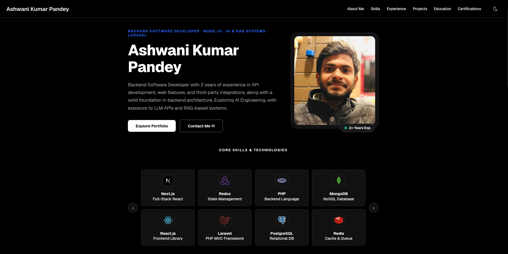
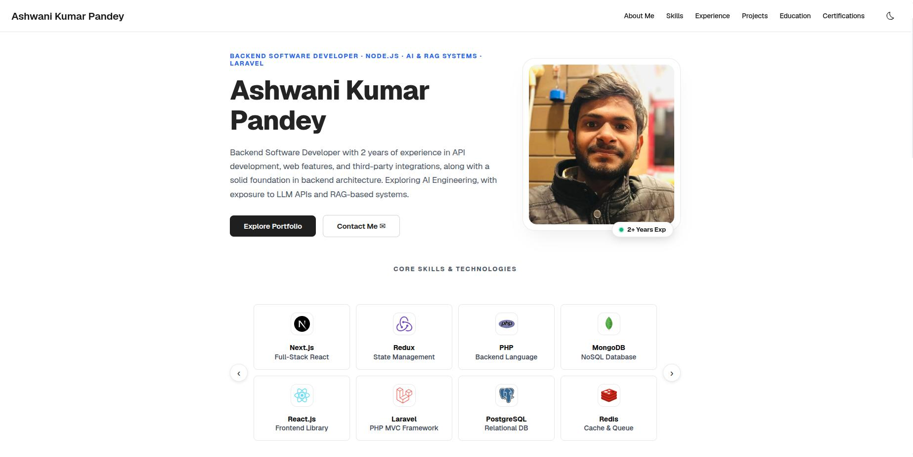
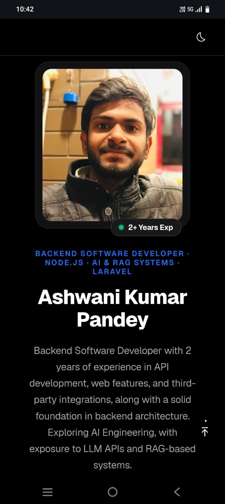
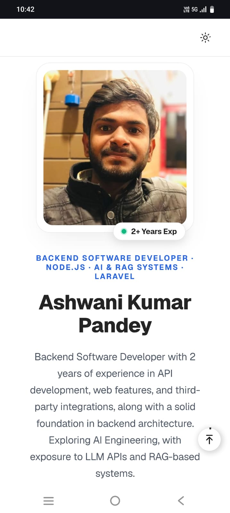

# Ashwani Kumar Pandey - Developer Portfolio Website 🚀

This is the source code for my professional developer portfolio website. Built using **VuePress 2.x**, **Vue 3**, **Vite**, and custom **SCSS configurations**, it features a fully responsive design, custom interactive components, a seamless dark/light mode toggle, and organized content directories matching my professional resume.

---

## 📸 Portfolio Preview

### 🖥️ Desktop Web Experience

| 🌙 Dark Mode | ☀️ Light Mode |
| :---: | :---: |
|  |  |

### 📱 Responsive Mobile Experience

| 🌙 Mobile Dark View | ☀️ Mobile Light View |
| :---: | :---: |
|  |  |

---

## 🛠️ Tech Stack & Frameworks
- **Site Generator**: VuePress 2.x (Vite Bundler)
- **Frontend Core**: Vue 3 (Composition API)
- **Styling**: SCSS (Custom layouts & variables) & Tailwind CSS utilities
- **Hosting-ready**: Builds optimized static HTML assets

---

## ✨ Features
1. **Interactive Skills Carousel**: A dynamic, two-row sliding carousel on the landing page showing core technology badges (Node.js, Express, Next.js, React, Redux, Laravel, PostgreSQL, MongoDB, Redis, Kafka, Docker, etc.).
2. **Dynamic Dark/Light Mode**: Full theme toggle integration that updates document attributes dynamically and persists user settings in localStorage.
3. **Structured Portfolio Navigation**: Clear navbar and sidebar categories grouping about info, detailed tech skills, chronological experience, credentials (education & certificates), and featured projects.
4. **Breadcrumbs Navigation**: Automatically resolves route trees to display interactive breadcrumbs on document sub-pages.

---

## 📁 Directory Structure
```text
portfolio/
├── package.json                   # Project scripts and dependencies
├── README.md                      # Code repository documentation (this file)
├── README_GITHUB.md               # Ready-to-copy profile dashboard for GitHub
└── src/                           # Portfolio site source folder
    ├── README.md                  # Homepage content index (using custom layout)
    ├── about.md                   # About page details & objective
    ├── skills.md                  # Comprehensive technical skills matrix
    ├── experience.md              # Professional work history
    ├── projects.md                # AI, RAG, and distributed systems projects
    ├── education.md               # B.Tech (CGPA 7.5) & schooling credentials
    ├── certifications.md          # Cloud, Distributed Systems & AI credentials
    └── .vuepress/
        ├── client.js              # Global client-side interactions & layouts setup
        ├── config.js              # Routing, metadata, and navbar/sidebar menus
        ├── components/
        │   └── HomeLayout.vue     # Dynamic custom landing page component
        └── styles/
            └── index.scss         # Global SCSS variables, scrollbars & overrides
```

---

## 🚀 Getting Started

### 1. Prerequisites
Make sure you have [Node.js](https://nodejs.org/) (v18+) installed.

### 2. Install Dependencies
Run the following command at the root of the project directory to install all VuePress and bundler dependencies:
```bash
npm install
```

### 3. Start Development Server
Launch the local dev server with hot-reload enabled:
```bash
npm run dev:docs
```
Once started, open your browser and navigate to **`http://localhost:8080`** (or the alternative port printed in the terminal).

### 4. Build Production-ready Assets
Compile and optimize the portfolio into static HTML, CSS, and JS bundles for deployment:
```bash
npm run build:docs
```
The optimized files will be outputted to the `src/.vuepress/dist/` directory, which is ready to be uploaded to platforms like GitHub Pages, Netlify, Vercel, or traditional static file servers.
