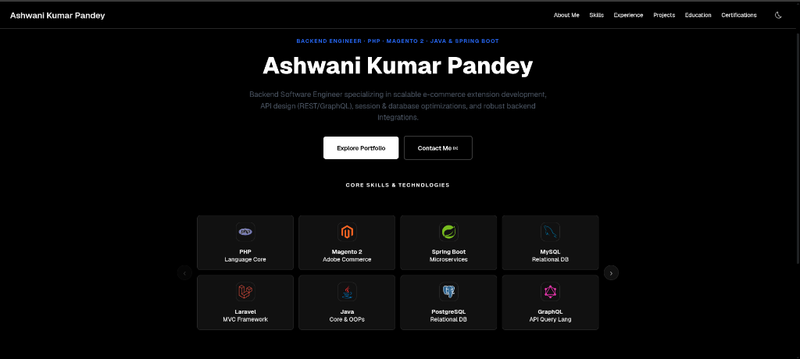

# Hi there, I'm Ashwani Kumar Pandey! 👋

### Backend Software Developer | Node.js, Laravel & AI Systems Specialist

Backend Software Developer with 2 years of experience in API development, web features, and third-party integrations, along with a solid foundation in backend architecture. Exploring AI Engineering, with exposure to LLM APIs and RAG-based systems.

---

### 🚀 Quick Stats & Highlights
- 💻 Specialized in scalable Node.js, Express, and Laravel backend architectures.
- 🤖 Exploring AI Engineering: Retrieval-Augmented Generation (RAG), vector databases, embeddings, and LLM APIs.
- ⚡ Reduced mobile API response latency by **70%** via Redis caching, PostgreSQL tuning, and async cron jobs.
- 📨 Built distributed background task execution pipelines with **Apache Kafka** and Docker.
- 🎓 B.Tech in Information Technology from AKTU (CGPA: 7.5).
- 💼 Passionate about clean code, SOLID principles, and microservices design patterns.

---

### 🛠️ Tech Stack & Ecosystem

  <!-- Backend & Languages -->
  
  
  
  
  
  
  <!-- Frontend & UI -->
  
  
  
  
  
  <!-- Databases & Caching -->
  
  
  
  
  
  <!-- Messaging, Real-time & APIs -->
  
  
  
  
  
  <!-- Cloud, Testing & Tools -->
  
  
  
  
  

---

### 📁 Featured Projects
- **AI Document Q&A Platform**: Full-stack SPA with React, Redux, and Node.js. Built an end-to-end RAG pipeline chunking documents into vector embeddings and querying a vector DB to synthesize context-aware answers via LLM APIs.
- **Distributed Job Processing Platform**: Event-driven Node.js backend utilizing Apache Kafka for asynchronous background queues, Redis for caching and duplicate prevention, and Docker for portable containerization.
- **Freelance Lead Hunter**: React/Redux automation dashboard aggregating project leads with Apify, utilizing an LLM layer for proposal drafting and Recharts + MongoDB for conversion analytics.
- **AlerTrax (IoT Asset-Tracking Platform)**: Developed Node.js APIs and React dashboard components for live GPS fleet tracking, integrated with Stripe for recurring subscription billing.

---

### 📈 GitHub Statistics & Activity

  
  

---

### 🤝 Connect with Me

  
  
  

---

*“Engineering scalable backends, distributed message queues, and AI-driven architectures.”*
